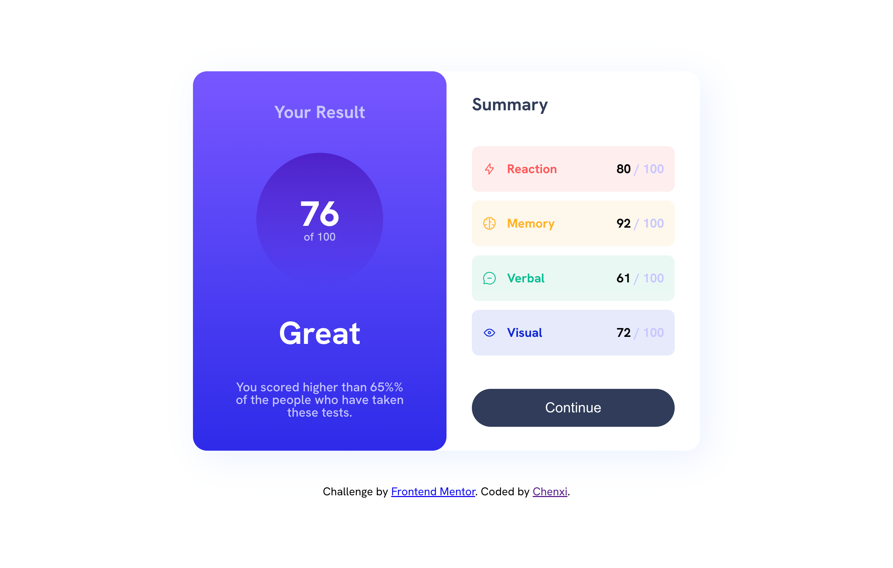

# Frontend Mentor - Results summary component solution

This is a solution to the [Results summary component challenge on Frontend Mentor](https://www.frontendmentor.io/challenges/results-summary-component-CE_K6s0maV). Frontend Mentor challenges help you improve your coding skills by building realistic projects. 

## Table of contents

- [Overview](#overview)
  - [The challenge](#the-challenge)
  - [Screenshot](#screenshot)
  - [Links](#links)
- [My process](#my-process)
  - [Built with](#built-with)
  - [What I learned](#what-i-learned)
  - [Continued development](#continued-development)
  - [Useful resources](#useful-resources)
- [Author](#author)

**Note: Delete this note and update the table of contents based on what sections you keep.**

## Overview

### The challenge

Users should be able to:

- View the optimal layout for the interface depending on their device's screen size
- See hover and focus states for all interactive elements on the page
- **Bonus**: Use the local JSON data to dynamically populate the content

### Screenshot



### Links

- Solution URL: (https://github.com/Chenxi96/ResultSummaryComponent)
- Live Site URL: (https://sparkling-youtiao-463c44.netlify.app/)

## My process

### Built with

- Semantic HTML5 markup
- Flexbox
- Javascript
- SASS
- JSON fetch function


### What I learned

While started this challenge I had trouble thinking about how to create and append elements into the HTML and with some trial and error
I figured out how I can do it. I had to create new HTML elements with document.createElement and add a class name and append it into scoreContainer div then styled it with scss.

see below:

```html
      <div id="scoreContainer" class="scoreContainer">
      </div>
```
```scss
.scoreContainer {
    display: flex;
    flex-direction: column;
    align-content: space-evenly;
    justify-content: space-evenly;
    height: 60%;
    width: 80%;
}

.Reaction {
    @include scoretype;
    background-color: $LightRed;
    color: hsl(0, 100%, 67%);
}

.Memory {
    @include scoretype;
    background-color: $OrangeyYellow;
    color: hsl(39, 100%, 56%)
}

.Verbal {
    @include scoretype;
    background-color: $GreenTeal;
    color: hsl(166, 100%, 37%)
}

.Visual {
    @include scoretype;
    background-color: $CobaltBlue;
    color: hsl(234, 85%, 45%);
}
```
```js
fetch('data.json')
.then(res => res.json())
.then(data => {
    summary = data
    renderSum()
    averageScore()
})

function renderSum() {
    summary.map(sum => {
        let divCategory = document.createElement('div');
        let divAline = document.createElement('div');
        let image = document.createElement('img');
        let p = document.createElement('p');
        let pCategory = document.createElement('p');
        let span = document.createElement('span')
        image.src = sum.icon;
        image.alt = 'icon';
        pCategory.textContent = sum.category
        divCategory.className = sum.category;
        divAline.className = 'aline';
        p.className = 'decriptionP';
        span.className = 'sumOutcome';
        span.textContent = sum.score;
        p.textContent = ' / 100';
        
        scoreContainer.appendChild(divCategory);
        divCategory.appendChild(divAline);
        divAline.appendChild(image);
        divAline.appendChild(pCategory)
        divCategory.appendChild(p);
        p.appendChild(span)
        p.insertBefore(span, p.firstChild)
    })
}
```


### Continued development

Will like to get better at styling SASS and transition fully to SASS.


### Useful resources

- [HTML Document](https://www.w3schools.com/jsref/dom_obj_document.asp) - This helped me in creating elements through Javascript.
- [HTML Element](https://www.w3schools.com/jsref/dom_obj_all.asp) - This site helped me in appending the element into specific HTML elements through Javascript.


## Author

- Website - [Chenxi](https://my-portfolio-vert-xi-14.vercel.app/)
- Frontend Mentor - [@Chenxi96](https://www.frontendmentor.io/profile/Chenxi96)
- Twitter - [@Chenxi_Lin_](https://www.twitter.com/Chenxi_Lin_)
